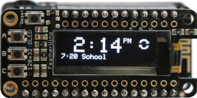

# esp8266-alarm_clock
##There is no better feeling than not having to set an alarm

ESP8266 based alarm clock. This project gets the time and your next alarm in Google Calendar from the Internet and displays this information. The alarm will go off and the board will beep and vibrate.

Remember to update the wireless settings (`_wifi` in `alarm_clock.ino`); install your Google script and update dstPath in `GoogleCalEvent.cpp` accordingly.

Libraries required

* [WiFiClientSecureRedirect](https://github.com/cvonk/esp8266-WiFiClientSecureRedirect)
* [Adafruit_GFX](https://github.com/adafruit/Adafruit-GFX-Library)
* [Adafruit_SSD1306](https://github.com/adafruit/Adafruit_SSD1306)

Continue reading at [coertvonk.com](http://www.coertvonk.com/technology/embedded/connected-alarm-using-esp8266-15838).